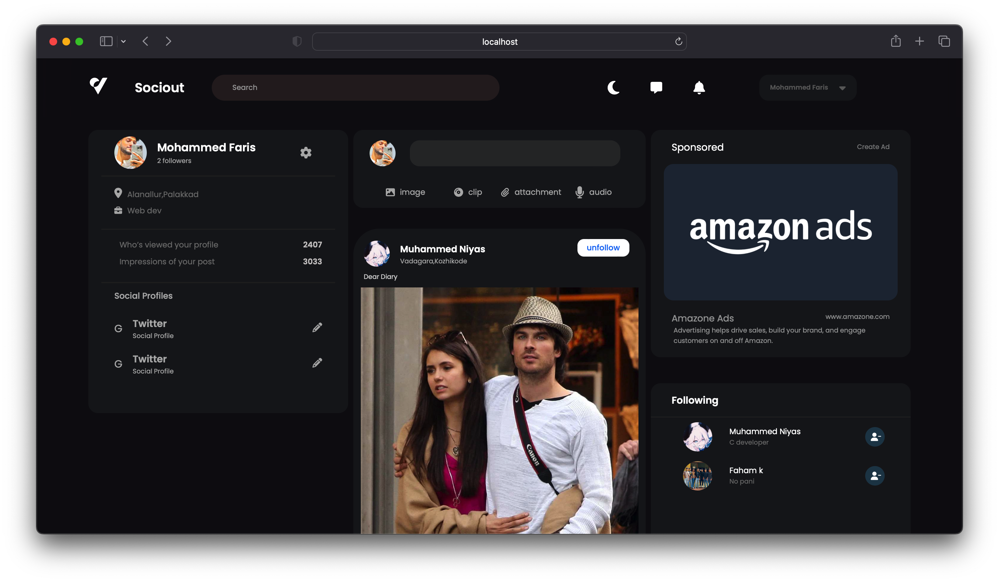

<br/>
<p align="center">
  <a href="https://github.com/mohammedfarisofficial/social-media">
    
  </a>

  <h3 align="center">Sociout - Social Media</h3>

  <p align="center">
    This is a social media web app developed using react.js , the framework of Javascript .State management is done by redux toolkit and styled by node-sass.The database is mongodb.Node.js for server and Jwt (json web token) is used for authentication .
    <br/>
    <br/>
    <a href="https://github.com/mohammedfarisofficial/social-media">View Demo</a>
    .
    <a href="https://github.com/mohammedfarisofficial/social-media/issues">Report Bug</a>
    .
    <a href="https://github.com/mohammedfarisofficial/social-media/issues">Request Feature</a>
  </p>
</p>

   

## Table Of Contents

- [About the Project](#about-the-project)
- [Built With](#built-with)
- [Getting Started](#getting-started)
  - [Prerequisites](#prerequisites)
  - [Installation](#installation)
- [Usage](#usage)
- [Contributing](#contributing)

## About The Project



This is a social media web app developed using react.js , the framework of Javascript .State management is done by redux toolkit and styled by node-sass.The database is mongodb.Node.js for server and Jwt (json web token) is used for authentication .

## Built With

React.js and Node.js

- [React.js](https://reactjs.org/)
- [Node.js](https://nodejs.org/)
- [MongoDB](https://www.mongodb.com/)

## Getting Started

This is an example of how you may give instructions on setting up your project locally.
To get a local copy up and running follow these simple example steps.

### Prerequisites

This is an example of how to list things you need to use the software and how to install them.

- npm

```sh
npm install npm@latest -g
```

### Installation

1. Clone the repo

```sh
git clone https://github.com/your_username_/Project-Name.git
```

2. Install NPM packages

```sh
npm install
```

4. Enter your API in `config.js`

```JS
const REACT_APP_API_URL = 'ENTER YOUR API';
```

## Usage

Share photo and text with friends.

## Contributing

Contributions are what make the open source community such an amazing place to be learn, inspire, and create. Any contributions you make are **greatly appreciated**.

- If you have suggestions for adding or removing projects, feel free to [open an issue](https://github.com/mohammedfarisofficial/social-media/issues/new) to discuss it, or directly create a pull request after you edit the _README.md_ file with necessary changes.
- Please make sure you check your spelling and grammar.
- Create individual PR for each suggestion.
- Please also read through the [Code Of Conduct](https://github.com/mohammedfarisofficial/social-media/blob/main/CODE_OF_CONDUCT.md) before posting your first idea as well.

### Creating A Pull Request

1. Fork the Project
2. Create your Feature Branch (`git checkout -b feature/AmazingFeature`)
3. Commit your Changes (`git commit -m 'Add some AmazingFeature'`)
4. Push to the Branch (`git push origin feature/AmazingFeature`)
5. Open a Pull Request
